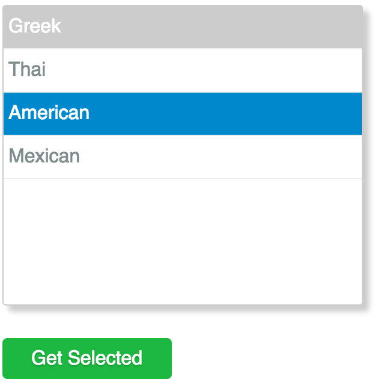

JavaScript Multiselect Widget
=============================

This JavaScript component is a widget that provides a multi-select box control. You provide an array of data, call the **render()** method, and the control is rendered. This widget allows users to select items by simply clicking on the items without having to press the CTRL key.



## Usage

First include the CSS and JavaScript in your web page.

```html
<link rel="stylesheet" href="multiselect.css" />
<script type="text/javascript" src="multiselect.js"></script>
```

Once it is included place a *DIV* somewhere. Then using a little bit of JavaScript initialize the control.

```html
<div id="food"></div>
<br />
<button type="button" id="getSelected">Get Selected</button>

<script type="text/javascript">
	var foodSelector = window.multiselect.render({
		elementId: "food",
		data: [
			{ "value": 1, "text": "Greek" },
			{ "value": 2, "text": "Thai" },
			{ "value": 3, "text": "American", "selected": true },
			{ "value": 4, "text": "Mexican" }
		]
	});

	document.getElementById("getSelected").addEventListener("click", function() {
		console.log(obj.getSelected());
		console.log(obj.getSelectedIndexes());
		console.log(obj.getSelectedValues());
	});
</script>
```

### License

The MIT License (MIT)

Copyright (c) 2015 Adam Presley

Permission is hereby granted, free of charge, to any person obtaining a copy
of this software and associated documentation files (the "Software"), to deal
in the Software without restriction, including without limitation the rights
to use, copy, modify, merge, publish, distribute, sublicense, and/or sell
copies of the Software, and to permit persons to whom the Software is
furnished to do so, subject to the following conditions:

The above copyright notice and this permission notice shall be included in all
copies or substantial portions of the Software.

THE SOFTWARE IS PROVIDED "AS IS", WITHOUT WARRANTY OF ANY KIND, EXPRESS OR
IMPLIED, INCLUDING BUT NOT LIMITED TO THE WARRANTIES OF MERCHANTABILITY,
FITNESS FOR A PARTICULAR PURPOSE AND NONINFRINGEMENT. IN NO EVENT SHALL THE
AUTHORS OR COPYRIGHT HOLDERS BE LIABLE FOR ANY CLAIM, DAMAGES OR OTHER
LIABILITY, WHETHER IN AN ACTION OF CONTRACT, TORT OR OTHERWISE, ARISING FROM,
OUT OF OR IN CONNECTION WITH THE SOFTWARE OR THE USE OR OTHER DEALINGS IN THE
SOFTWARE.

